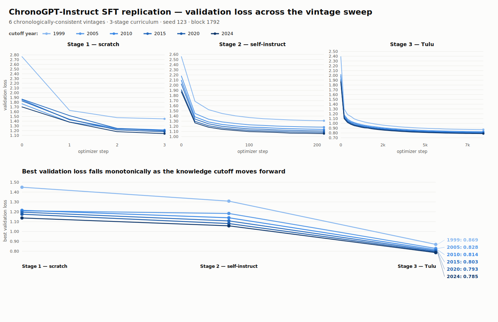

# Replication Report — Instruction Tuning of ChronoGPT

**Paper.** He, Lv, Manela & Wu (2025), *"Instruction Tuning Chronologically
Consistent Language Models"* (SSRN 5348747 / arXiv 2510.11677).
**This report.** A faithful reconstruction of the paper's SFT / instruction-tuning
pipeline, with the six headline vintages trained end-to-end from the released
`chrono-gpt-v1` base weights.
**Author.** Huanyu Zhang · **Prepared for.** Prof. Asaf Manela.

---

## 1. Abstract

The authors released the ChronoGPT-Instruct **weights** and the **SFT data**
(`manelalab/ChronoInstruct-SFT`) but not the **training code**. This repository
reconstructs that code and re-runs the full pipeline: it re-derives the paper's
data screen and trains all six headline vintages
(τ ∈ {1999, 2005, 2010, 2015, 2020, 2024}) through the 3-stage curriculum
(scratch → GPT-3 self-instruct → Tulu-3), one model per knowledge cutoff, from the
matching `chrono-gpt-v1` base (~1.55 B params, 52-layer modded-nanoGPT U-net,
`model_dim` 1536, 12 heads, vocab 50304, context 1792). **Headline result:** the
3-stage curriculum chains cleanly (each stage resumes near the prior stage's
endpoint and improves), and the final Stage-3
validation cross-entropy falls **monotonically** as the cutoff moves forward —
0.8691 (1999) → 0.7855 (2024) — exactly the "later vintage = better language
model, not leakage" structure the paper predicts. The fine-tuned models are on the
Hub under `HZ0619/chrono-instruct-v1-{vintage}1231`. **Status:** the SFT training
exhibits (data screen, loss curves, curriculum behavior) and the two
chronological-consistency exhibits (Tables 2–3) are complete — **the consistency
tests show zero post-cutoff leakage across all six vintages, with pre-cutoff
accuracy rising as the cutoff advances** (§6). AlpacaEval (Figure 3) is run: our
vintages win a modest **8–11 %** LC share vs Qwen (paper: 12.6–16.8 %), the same
"leakage-free but competitive" story at a lower absolute level (§6b).

---

## 2. Scope & status

| # | Exhibit | What it establishes | Status |
|---|---------|---------------------|--------|
| Table 1 | Temporal data screen (647,944 → 425,119) | The pre-2000 / confidence-10 filter reproduces the paper's counts | ✅ done |
| Figs 1–2 | SFT loss curves, 6 vintages × 3 stages | Curriculum chains cleanly; monotone improvement with cutoff | ✅ done |
| — | Six trained vintages pushed to HF | Reusable, leakage-free instruct models | ✅ done |
| Table 2 | U.S. president consistency test | Correct pre-cutoff, blind post-cutoff | ✅ done (§6) |
| Table 3 | Major-world-events test | Same chronological-consistency pattern | ✅ done (§6) |
| Figure 3 | AlpacaEval LC win-rate vs Qwen-1.5-1.8B-Chat | Instruction-following quality (paper 12.6–16.8%; ours 8–11%) | ✅ done (§6b) |
| — | Uncapped full-validation re-scoring | Tightens the noisy Stage-1 training-time numbers | ⏳ coded, not yet run |

Not in scope (by design): any downstream return-prediction / trading application
built on these models needs external news and market data (e.g. a newswire feed +
CRSP) that is not part of this repo. This repository reproduces the *model and its
validation* — the instruction-tuning infrastructure; an asset-pricing study would
be a downstream use of the trained vintages.

---

## 3. Table 1 — data screen reproduction

The released `ChronoInstruct-SFT` has **647,944** rows. The paper keeps only pairs
the authors' **GPT-4.1** temporal classifier marked `label 0` ("knowledge
available pre-2000") with `confidence == 10` — a deliberately strict double
filter. Reproducing that screen (`keep_row` / `_parse_label` in `data.py`,
`min_confidence: 10`) yields:

| Stage | Source | Rows after screen | Paper Table 1 |
|-------|--------|------------------:|--------------:|
| 1 | LLMs-from-scratch simple tasks | 1,097 | 1,097 |
| 2 | GPT-3 self-instruct | 67,136 | 67,136 |
| 3 | AllenAI Tulu-3 mixture | 356,886 | 356,886 |
| **Total** | | **425,119** | **≈425,119** |

**The one consequential fidelity fix.** An initial JSON-only label parser
(`json.loads`) silently dropped **every** Tulu row, collapsing Stage 3 to ~32k and
the total to ~100k. Cause: the classifier verdicts are stored **inconsistently** —
scratch and self-instruct rows use valid JSON (`'{"label": 0, ...}'`), but Tulu
rows store single-quoted Python-dict reprs (`"{'label': 0, ...}"`), which
`json.loads` cannot parse. Because Stage 1 (1,097) and Stage 2 (67,136) matched the
paper *exactly*, the discrepancy isolated cleanly to parsing rather than the
confidence threshold. Adding an `ast.literal_eval` fallback in `_parse_label`
recovered Tulu to 356,886 and the total to **425,119**, matching the paper. This is
the single most consequential fidelity fix in the replication
(`docs/implementation-notes.md` §3).

---

## 4. SFT results

Each cell is the **best validation cross-entropy** (token-weighted, 5% seeded
held-out split; lower is better), read from
`results/chrono-instruct-{τ}/summary.json`.

| Vintage | Base model (HF) | Stage 1 (scratch) | Stage 2 (self-instruct) | Stage 3 (Tulu) |
|--------:|-----------------|------------------:|------------------------:|---------------:|
| 1999 | `manelalab/chrono-gpt-v1-19991231` | 1.4492 | 1.3080 | **0.8691** |
| 2005 | `manelalab/chrono-gpt-v1-20051231` | 1.2098 | 1.1827 | **0.8279** |
| 2010 | `manelalab/chrono-gpt-v1-20101231` | 1.2147 | 1.1390 | **0.8137** |
| 2015 | `manelalab/chrono-gpt-v1-20151231` | 1.1960 | 1.1075 | **0.8026** |
| 2020 | `manelalab/chrono-gpt-v1-20201231` | 1.1751 | 1.0801 | **0.7931** |
| 2024 | `manelalab/chrono-gpt-v1-20241231` | 1.1370 | 1.0573 | **0.7855** |

*(Combined figure: `results/combined/sweep_combined.svg`. Per-run loss curves are
in each `results/chrono-instruct-{τ}/metrics.csv`, the source for Figures 1–2.)*

**Run profile** (identical across all six, from `summary.json` + per-run
`config.yaml`): one 80 GB card, **~19.4 h** wall-clock each (69,423–70,486 s),
peak **50.4 GB** GPU, seed **123**, block **1792**, `batch_size` **8** ×
`grad_accum` **4** (effective batch 32), gradient checkpointing on. All three
stages use `lr 3e-4` with a per-stage cosine schedule (warmup 0.03, floor
`0.1·lr`); epochs 3 / 2 / 2 for stages 1 / 2 / 3.

**What the numbers say.**
- **Monotone improvement with cutoff.** Stage-3 loss falls strictly as τ advances
  (0.8691 → 0.8279 → 0.8137 → 0.8026 → 0.7931 → 0.7855). Later vintages pretrained
  on more (pre-cutoff) text are better language models — the paper's
  Figure-2 reading, and the clean disentangling of "knowledge recency" from
  "knowledge of the future." Stage 2 is monotone as well; Stage 1 is near-monotone
  (a single 2005↔2010 crossing of 0.005, within the noise of its very short
  validation set — see §6, uncapped re-scoring).
- **The curriculum chains cleanly.** Each stage begins near the previous stage's
  endpoint and improves through it, and the largest single drop is at the Stage-2 →
  Stage-3 (Tulu) transition — the qualitative shape of the paper's Figure 1.

**Comparison to the paper (Figs 1–2).** The *structure* matches: same stage-wise
descent, same monotone-with-cutoff ordering, same "Tulu does the heavy lifting"
shape. Absolute loss values are **not** expected to match to the decimal — see the
caveat in §8 (the LR schedule and epoch counts are our tuning against the *shape*
of the paper's Figure 1, which the paper does not fully disclose).

---

## 5. Implementation details

Each choice cites its source file. Faithful reproductions and deliberate
deviations are both documented, per the paper's "specifies the *what*, not the
*how*" gap.

**Faithful to the paper**
- **Alpaca prompt template, verbatim.** Stanford Alpaca `PROMPT_DICT` reproduced
  exactly, with one deliberate change: a trailing `\n` after `### Response:`,
  because ChronoGPT's own rendering puts the response on the next line. We
  A/B-tested this against the released model's `extract_response` format on the
  same instruct vintage; `extract_response` produced **degenerate output**, so we
  kept the Alpaca template. This is a format effect, not a weights issue — our
  `model.py` is numerically bit-identical to the official `ChronoGPT_inference.py`
  (max logit diff 0.0). (`data.py`; `implementation-notes.md` §1, §6)
- **Response-only masked cross-entropy.** `pack_blocks` sets `labels = -100` on
  prompt tokens and the true id on response tokens (`IGNORE_INDEX = -100`), so loss
  scores only the response — the standard SFT reading of the paper's "masked
  cross-entropy" (eq. 9). (`data.py`; §2)
- **Single conservative pre-2000 screen, reused across vintages.** One screen at
  the pre-2000 boundary serves every τ ≥ 1999 because pre-2000 ⊆ pre-τ. The screen
  is therefore model-independent — filtered + packed **once** and cached, with only
  `model_repo` varying per run — which is the operational form of the paper's
  stage-wise sufficiency (eq. 7). (`data.py` `prepare_stages`; §3)
- **Label-parsing robustness fix.** The `ast.literal_eval` fallback in
  `_parse_label` (see §3 above), which restores the paper's 425,119 total. (§3)
- **Full fine-tuning, no PEFT.** All 1.55 B parameters updated with AdamW; no
  LoRA/adapters, matching the paper's full SFT. (`train.py`; §7)

**Deliberate engineering deviations (gaps the paper leaves open)**
- **Packing, not padding — for throughput.** Examples are concatenated into fixed
  1792-token blocks (the pretraining / TRL `ConstantLengthDataset` convention)
  rather than padded. Motivated by efficiency: Stage-1 examples average ~102
  tokens, so padding each to 1792 would waste ~94% of every forward. Quantified
  cost: **5.1% of Tulu examples** exceed the block and are split across a boundary
  (Stages 1–2: 0%); the loss mask is carried so no response tokens are dropped, and
  the split is judged acceptable (a no-split best-fit refinement is deferred).
  (`data.py`; §4–5)
- **Gradient checkpointing.** Recompute each block in the backward pass (~10× less
  activation memory, ~20% slower) so `batch_size 8` fits one 80 GB card; a 40 GB
  card OOMs even at batch 1. (`config: grad_checkpoint: true`; §7)
- **Optional inference-time KV cache**, numerically identical to full recompute;
  **greedy decoding by default** (temperature 0, `top_k=None`), matching the
  released `ChronoGPT_instruct.py` generate defaults. (`infer.py`; §6)
- **One global seed (123)** drives the train/val split, DataLoader shuffle, and
  sampling — the run reproduces end-to-end. (`train.py`; §8)

---

## 6. Tables 2 & 3 — chronological-consistency results

Both tests run against the HF-published vintages (`scripts/run_eval.py` →
`results/chrono-instruct-{τ}/eval.json`, aggregated by `scripts/aggregate_eval.py`).
Each probes whether a vintage can name a dated fact given only prior context, decoded
**greedily** (2 tokens for presidents, 3 for events), exactly as the paper specifies.

**The claim being tested.** A chronologically consistent model should be **correct on
facts dated at/before its cutoff τ and blind (wrong) on facts after τ**. Post-cutoff
correctness would be look-ahead *leakage* — the failure mode the whole construction
exists to prevent. So the number to watch is the **post-cutoff-correct** column: it
should be **0** for every vintage.

Tables follow the paper's Table 2 / Table 3 layout: each **cell is the model's greedy
completion** for that year's blank; rows are our six vintages; the last two columns
are pre- and post-cutoff accuracy; the final row aggregates over all six. Cell styling
mirrors the paper's blue/gray coding: **bold** = correct (paper's blue); _italic_ =
post-cutoff prompt beyond the vintage's knowledge cutoff (paper's gray shading — the
model *should* be blind here, so an italic that is **not** bold is the desired
outcome); a **_bold-italic_** cell would be post-cutoff *leakage* (**none occur**).

### Table 2 — U.S. president prediction

Prompt (paper's template): the three prior presidents in order, then
"Took office in {year}: President ___". Columns are the target's inauguration year;
`past_cutoff` keys on that inauguration year (year > τ) — see the note below on how
this differs from the paper at the boundary.

| Vintage | 1993 Clinton | 2001 Bush | 2009 Obama | 2017 Trump | 2021 Biden | 2025 Trump | Pre | Post |
|:--|:--:|:--:|:--:|:--:|:--:|:--:|:--:|:--:|
| **1999** | Ronald Reagan | _John F_ | _Ronald Reagan_ | _Bill Clinton_ | _Obama_ | _John F_ | 0/1 | **0/5** |
| **2005** | George H | **George W** | _George W_ | _George W_ | _George W_ | _George W_ | 1/2 | **0/4** |
| **2010** | George H | **George W** | George W | _John H_ | _Bill Clinton_ | _George W_ | 1/3 | **0/3** |
| **2015** | **Bill Clinton** | **George W** | **Barack H** | _elect John_ | _John Paul_ | _George W_ | 3/3 | **0/3** |
| **2020** | **Bill Clinton** | **George W** | **Barack Obama** | **Donald Trump** | _Franklin D_ | _George W_ | 4/4 | **0/2** |
| **2024**† | George H | **George W** | Donald J | **Donald J** | **Joe Biden** | _Kamala_ | 3/5 | **0/1** |
| **1999–2024 (all 6)** |  |  |  |  |  |  | **12/18** | **0/18** |

### Table 3 — major world events

Prompt: a dated sentence with the key term blanked (Enron 2001, SARS 2003, GFC 2008,
Brexit 2016, COVID 2020, ChatGPT 2022); the model completes the term (3 greedy tokens).

| Vintage | 2001 Enron | 2003 SARS | 2008 GFC | 2016 Brexit | 2020 COVID | 2022 ChatGPT | Pre | Post |
|:--|:--:|:--:|:--:|:--:|:--:|:--:|:--:|:--:|
| **1999** | _ado de la_ | _the "C_ | _market, which_ | _._ | _Great Depress_ | _the "Ch_ | 0/0 | **0/6** |
| **2005** | **scandal, whic** | **SARS,** | _market, which_ | _._ | _"Asian flu_ | _"Chatbot_ | 2/2 | **0/4** |
| **2010** | **scandal, whic** | the H1 | **crisis, which** | _._ | _Black Death._ | _"The Turing_ | 2/3 | **0/3** |
| **2015** | **scandal, whic** | **SARS,** | **crisis, which** | _vote. This_ | _"Asian flu_ | _"The Talking_ | 3/3 | **0/3** |
| **2020** | **scandal, whic** | **SARS-** | **crisis, which** | **referendum. T** | **COVID-** | _"Q&_ | 5/5 | **0/1** |
| **2024** | **scandal, whic** | **SARS-** | **crisis, which** | **referendum. T** | **COVID-** | **"GPT** | 6/6 | **0/0** |
| **1999–2024 (all 6)** |  |  |  |  |  |  | **18/19** | **0/17** |

**What the two tables show** (compare the paper's 67/83 pre & 0/73 post for presidents,
76/80 & 0/76 for events — same shape, at our six-vintage scale):
- **Zero look-ahead leakage.** The **Post** column is **0/N for every vintage in both
  tables** (aggregate 0/18 and 0/17) — no vintage ever names a president or event dated
  after its cutoff. Every _italic_ cell is non-bold: the models are correctly *blind*
  to the future. This is the paper's core chronological-consistency claim, reproduced.
- **Pre-cutoff accuracy rises monotonically with τ.** As the knowledge window widens,
  the bold cells fill in left-to-right — president recall goes 0/1 → 1/2 → 1/3 → 3/3 →
  4/4 (1999 → 2020); events go 0/0 → 2/2 → 2/3 → 3/3 → 5/5 → 6/6. Later vintages know
  more *of their own past*, exactly as expected.
- **Plain (non-bold, non-italic) cells are capability misses, not leakage.** Early
  vintages — and the earliest-president slots, which under our six-name list get **no**
  prior context (the paper's fuller list always supplies three priors) — sometimes name
  the *wrong* pre-cutoff figure, e.g. 1999 → "Ronald Reagan" for 1993. These lower the
  Pre score but are irrelevant to the no-look-ahead guarantee, which is governed solely
  by the Post column. The signal that matters is clean everywhere.

†**2024 caveat.** The 2024 `eval.json` was produced by an interim variant of the
president harness (election-year keying + different early-slot context), since reverted
to the inauguration-year form the other five vintages use. Its cells above are
re-mapped to inauguration years and its Post label recomputed uniformly (year > τ), so
the leakage conclusion (0/1) stands; its pre-cutoff cells should be re-confirmed by
`python scripts/run_eval.py --vintage 2024` under the current harness. Table 3 is
harness-independent and needs no re-run.

**Boundary note (vs the paper).** The paper's Table 2 keys `past_cutoff` on the
**election** year (e.g. Biden's 2020 election is *pre*-cutoff for the τ=2020 model,
since the Nov-2020 result was knowable by Dec 31 2020). We key on the **inauguration**
year, so Biden is *post*-cutoff for τ=2020 here. This shifts at most one boundary cell
per vintage and never creates leakage (the Post column is still 0/N); it is a
deliberate simplification, not a fidelity claim.

---

## 6b. Figure 3 — AlpacaEval instruction-following

Length-controlled (LC) win-rate of each vintage vs **Qwen-1.5-1.8B-Chat** on the 805
AlpacaEval prompts, judged by `weighted_alpaca_eval_gpt4_turbo_new`. Both sides decode
**greedily** (matching the authors' released `ChronoGPT_instruct.py`: temperature 0,
argmax, no repetition penalty).

| Vintage τ | 1999 | 2005 | 2010 | 2015 | 2020 | 2024 |
|:--|:--:|:--:|:--:|:--:|:--:|:--:|
| **Ours (LC %)** | 8.39 | 7.96 | 10.14 | 10.05 | 9.86 | 10.95 |
| Paper (LC %) | 12.59 | 13.19 | 16.21 | 16.36 | 16.56 | 16.79 |

**Reading.** The qualitative story reproduces — a leakage-free ~1.55B model wins a
**modest but nonzero** share against a 31×-larger reference, with the latest vintage
(2024) the strongest, as in the paper. Absolute rates run **~4–7 pp below** the paper
and the vintage ordering is noisier (a dip at 2005, a plateau 2010–2020 rather than a
clean monotone rise). Diagnosis of the gap, in decreasing confidence:
- **Different judge.** The paper judged with `gpt-4-1106-preview` (now retired);
  we use a newer gpt-4-turbo. Different annotators shift the absolute LC level by
  several points, which alone explains most of a roughly-uniform downward offset.
- **Greedy degeneration.** **37–44 % of our completions** contain a verbatim repetition
  loop ("Use a sturdy, sturdy-looking gift bag" ×5) — the known failure mode of greedy
  decoding on a small model. These reliably lose to Qwen. We keep greedy on purpose
  (it is what the authors' code does), so this is a faithful cost, not a bug.
- **Independently-trained weights.** These are our own SFT vintages (`HZ0619`), tuned
  toward pipeline-correctness against the *shape* of the paper's loss curves, not the
  released `manelalab` weights. A somewhat weaker open-generation model — a few points
  of win-rate — is expected and consistent with the loss-value caveat in §8.

The **"54–62 %"** figure elsewhere in the paper is the **trading Sharpe-ratio** result
(Table 4), a different exhibit we do not reproduce — not the AlpacaEval win-rate.

> **Still pending:** *uncapped full-validation re-scoring* (`scripts/full_eval.py`)
> would tighten the noisy Stage-1 loss numbers by re-scoring the same seeded holdout
> with no `val_max_blocks` cap. Not yet run; it changes no headline result.

---

## 7. Reproducibility & pointers

- **Configs.** `configs/train.yaml` (annotated training config — the sweep default,
  with hyperparameter semantics inline); `configs/eval.yaml` (evaluation +
  Figure-3 pipeline). Per-run *actual* hyperparameters are frozen in each
  `results/chrono-instruct-{τ}/config.yaml`.
- **Results.** `results/chrono-instruct-{τ}/summary.json` (final losses, elapsed,
  peak GPU, hyperparameters) and `.../metrics.csv` (loss curves);
  `results/combined/sweep_combined.svg` (the combined figure).
- **Code.** `src/chrono_instruct/` — `data.py` (screen + packing), `train.py`
  (curriculum loop), `model.py` (vendored from `ChronoGPT_inference.py`),
  `infer.py`, `eval.py`, `figures.py`, `cli.py`. `scripts/` — sweep, publish, and
  `full_eval.py`.
- **Design log.** `docs/implementation-notes.md` (every open choice, with A/B
  tests and the box-verification results); `docs/walkthrough/` (paper-to-code map).
- **Models.** Fine-tuned vintages on the Hub:
  `HZ0619/chrono-instruct-v1-{1999,2005,2010,2015,2020,2024}1231`.
- **Seed.** 123, global, for every stage.

*Prof. Manela — if it is useful, the fastest way to audit fidelity is
`docs/implementation-notes.md` §1–4 (the four resolved design decisions) and any
single `results/chrono-instruct-{τ}/config.yaml` next to its `summary.json`.
I would welcome your correction on any of the "how" choices the paper left open,
especially the masked-loss reading (§2) and the packing/split handling (§4).*

---

## 8. Honest caveats

- **Loss values are not expected to match the paper to the decimal.** The
  learning-rate schedule and epoch counts are **our** tuning against the *shape* of
  the paper's Figure 1 (the paper does not fully disclose them). The replication
  claim is the **qualitative structure** — the data-count match (§3), clean
  curriculum chaining, and monotone improvement with cutoff (§4) — not absolute
  parity. The model is deliberately trained toward pipeline-correctness first.
- **Stage-1 validation is noisy.** Its ~3-block capped validation set makes the
  Stage-1 column the least precise; the uncapped re-scoring in §6 will tighten it.
- **"masked cross-entropy" is mildly ambiguous in the paper** — it could denote
  only the causal mask. We adopt response-only masking, the near-universal SFT
  reading (§5, §2); worth confirming.
- **All exhibits are run (§6, §6b).** The consistency tests use small hand-built probe
  sets (6 presidents, 6 events) transcribed from the paper — they demonstrate the
  leakage/no-leakage structure, not a large-sample accuracy estimate. The 2024
  president row was scored under an interim harness (§6†) and is flagged for a
  one-command re-run.
- **Figure 3 runs ~4–7 pp below the paper (§6b).** The story reproduces (modest,
  cutoff-increasing win-rate vs a far larger Qwen) but the absolute level is lower,
  driven by a different judge model, ~40 % greedy repetition-degeneration, and our
  independently-trained weights. Not a pipeline bug — a faithfulness-vs-leaderboard
  tradeoff consistent with the loss-value caveat above.
- **Packing splits ~5.1% of Tulu examples** at block boundaries; no response tokens
  are lost, but such examples are never seen whole in one forward (§5).
